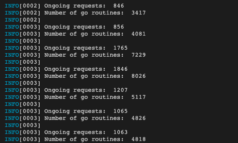
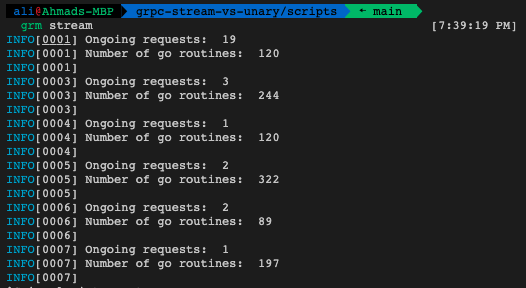
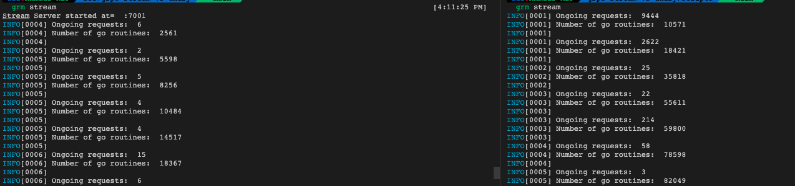

# grpc-stream-vs-unary

A project to analyze the performance of both unary and stream connection and create a POC for proper stream data communication.
This project sends 100 requests per seconds to the server using corresponding method chosen (unary/stream).

## Updating generated golang file from proto

```bash
protoc --go_out=. --go_opt=paths=source_relative \      [4:16:53 PM]
    --go-grpc_out=. --go-grpc_opt=paths=source_relative \
    main.proto
```

## How to use

To run this project, you need to run the server and client code in separate terminal window. Follow these steps to run the performance test:

- Unary Connection

  1. run `go run ./main.go`
  2. open new terminal window and run `go run ./scripts/main.go`
  3. Observe that there are a lot of hanging requests and also go routines.

     

- Stream Connection

  1. run `go run ./main.go stream`
  2. open new terminal window and run `go run ./scripts/main.go stream`
  3. Observe that there are much less hanging requests and go routines compared to when we use grpc unary connections.

     

## UPDATE

when performing stream for multiple services, I noticed there has been significant jump in the requests hanging and go routines running. I assume this is due to the re-creation of stream (that has to be done to the fact that a stream corresponds to a service, not a connection)




